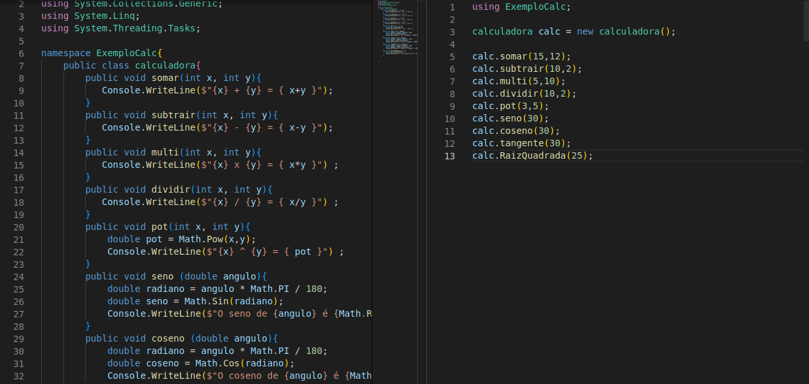
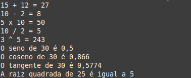

# C# Primeiras Linhas
<h2>Começando a programação com C# - Calculadora com funções: Somar, subtrair, multiplicar, dividir, potencia, raiz quadrada, seno, coseno e tangente.</h2>

<h2>Código</h2>

Codigo feito no Bootcamp Pottencial .Net Developer da DIO.

<h2>Tecnologias</h2>

- C# 

- GIT e GitHub 

<h2>Contato</h2>

viktorariel777@gmail.com

